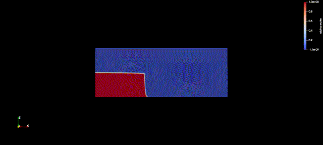
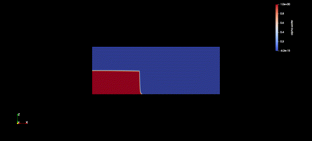
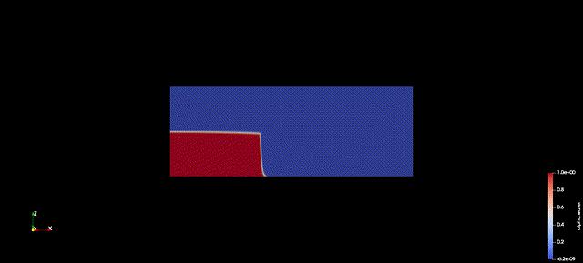
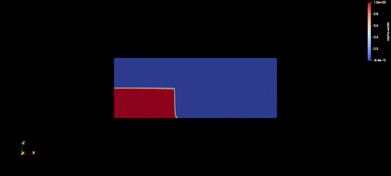

# Dam break cases (for OF v8)

## 2D
### laminar model

### turbulence model


## 3D
### laminar model

### turbulence model


# Changes for OF 2016
In `controlDict`:
```Openfoam
// OpenFOAM v8
     gaugesSurge
     {
         type    sets;
         libs ("libsampling.so");
         writeControl    outputTime;
         writeInterval   1;
         setFormat       raw;
         surfaceFormat   raw;
         interpolationScheme cell;
         outputControl   timeStep;
         outputInterval  1;
         fields          ( alpha.water );
         sets
         (
             GaugeVOF01
             {
                 type    lineCellFace;
                 axis    xyz;
                 start   (0 0.075 0);
                 end     (1.610 0.075 0);
             }
         );
     } 

```

to
```Openfoam
// OpenFOAM v2016
     gaugesSurge
     {
         type    sets;
         libs ("libsampling.so");
         writeControl    outputTime;
         writeInterval   1;
         setFormat       raw;
         surfaceFormat   raw;
         interpolationScheme cell;
         outputControl   timeStep;
         outputInterval  1;
         fields          ( alpha.water );
         sets
         (
             GaugeVOF01
             {
                 type    midPoint;
                 axis    xyz;
                 start   (0 0.075 0);
                 end     (1.610 0.075 0);
             }
         );
     } 

```